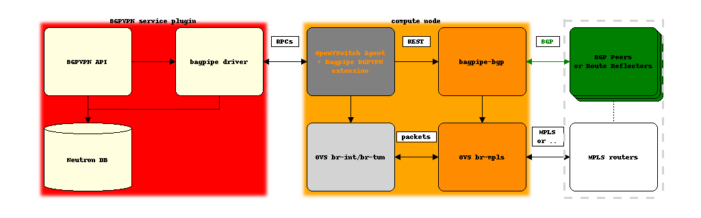

Applications
============

------------------------------
Neutron BGPVPN Interconnection
------------------------------

.. Note:: This application is distinct from the use of BaGPipe to realize
   Neutron networks with BGP E-VPNs. ``bagpipe`` driver for
   networking-bgpvpn_ supports both IPVPNs and E-VPNs, but does not rely on
   ``bagpipe`` ML2 mechanism driver to do so.

In this application, ``networking-bagpipe`` aims at proposing a lightweight
implementation of the BGPVPN Interconnection service, designed to work with
the ML2 ``openvswitch`` mechanism drivers (or as an
alternative with the ``bagpipe`` ML2 mechanism driver).

When used along with the ``openvswitch`` ML2 mechanism
driver, it involves the use of:

* ``bagpipe`` driver for the BGPVPN service plugin (in networking-bgpvpn_ package)

* ``bagpipe_bgpvpn`` extension for the Neutron compute node agent
  (in this package)

* :ref:`bagpipe-bgp` lightweight BGP VPN implementation (in this package)

Example with OVS agent:

----------------------------------------
Work in progress and future applications
----------------------------------------

Work in progress:

* BaGPipe ML2 with openvswitch agent

Considered:

* networking-l2gw driver leveraging bagpipe-bgp running on a ToR

* L3 plugin for inter-subnet distributed routing

.. _networking-bgpvpn: https://github.com/openstack/networking-bgpvpn
.. _BGPVPN documentation: https://docs.openstack.org/networking-bgpvpn/latest/user/drivers/bagpipe/index.html
.. _draft-ietf-bess-service-chaining: https://tools.ietf.org/html/draft-ietf-bess-service-chaining
